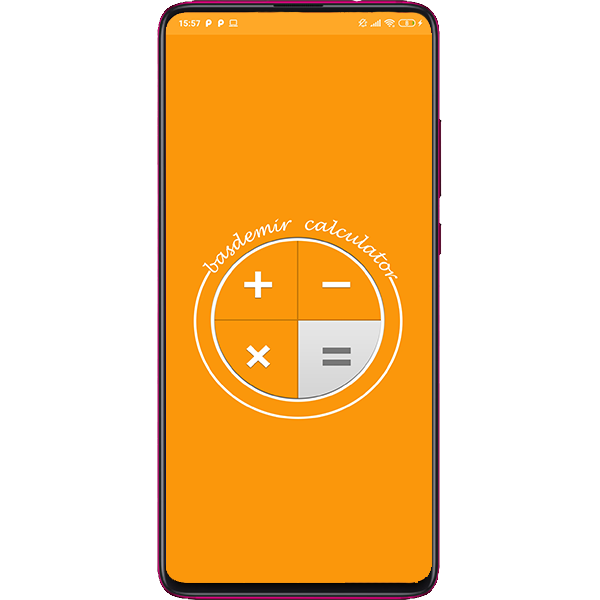
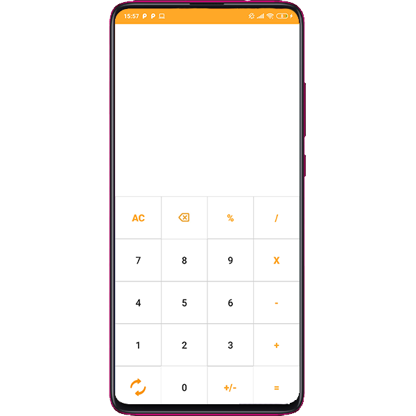
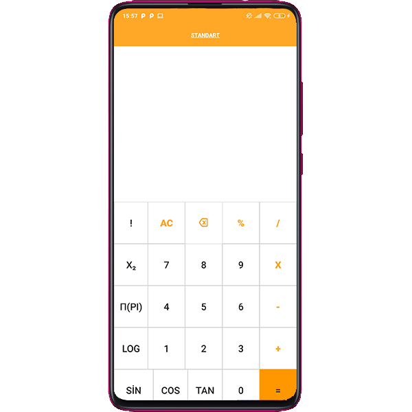
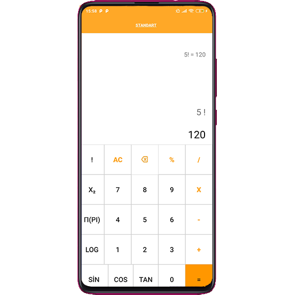

# Android Hesap Makinesi

### İÇİNDEKİLER
- Proje Amacı ve Özellikleri
- Proje Görselleri

## Proje Amacı
Uygulamam basit veya zorlu hesaplamaları kolayca çözmenize olanak sağlayan hesap makinesidir. 

- Toplama 
- Çıkarma 
- Bölme
- Çarpma 
- Yüzde 
- Kare Alma 
- PI sayı çarpanı 
- Logaritma
- Sinüs , Cosinüs, Tanjant 

İşlemleri yapabilmektedir. Geçmiş işlemlerden hangi işlemleri yaptığınızı takip edebilir dilerseniz bu işlemleri silebilirsiniz.

### - Proje Görselleri

